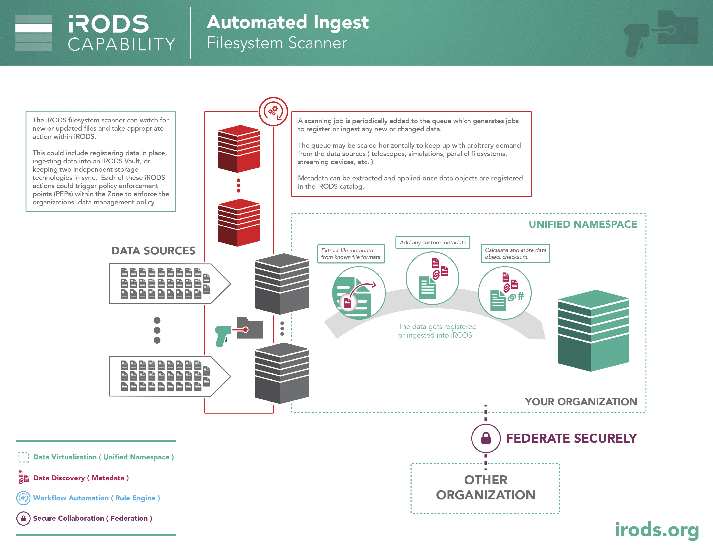
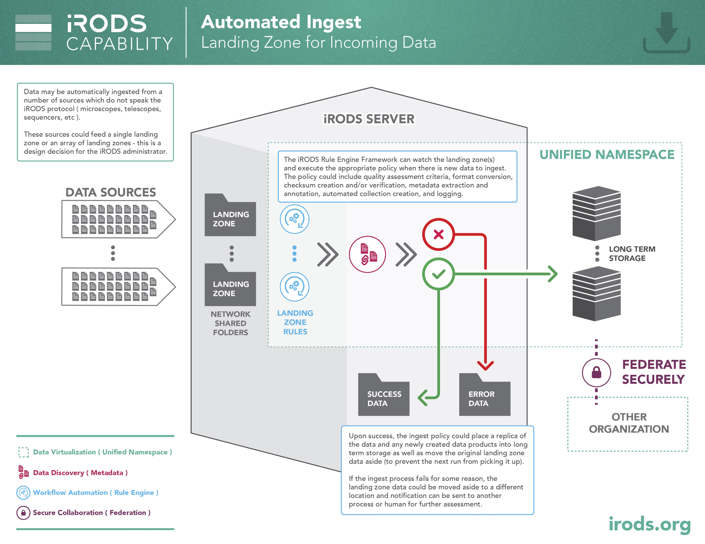

# iRODS Automated Ingest Framework

The automated ingest framework gives iRODS an enterprise solution that solves two major use cases: getting existing data under management and ingesting incoming data hitting a landing zone.

Based on the Python iRODS Client and RedisQueue, this framework can scale up to match the demands of data coming off instruments, satellites, or parallel filesystems.

The example diagrams below show a filesystem scanner and a landing zone.





## Usage options

### available `--event_handler` methods

| method |  effect  | default |
| ----   |   ----- |  ----- |
| pre_data_obj_create   |   user-defined python  |  none |
| post_data_obj_create   | user-defined python  |  none |
| pre_data_obj_modify     |   user-defined python   |  none |
| post_data_obj_modify     | user-defined python  |  none |
| pre_coll_create    |   user-defined python |  none |
| post_coll_create    |  user-defined python   |  none |
| pre_coll_modify    |   user-defined python |  none |
| post_coll_modify    |  user-defined python   |  none |
| as_user |   takes action as this iRODS user |  authenticated user |
| target_path | set mount path on the irods server which can be different from client mount path | client mount path |
| to_resource | defines  target resource request of operation |  as provided by client environment |
| operation | defines the mode of operation |  `Operation.REGISTER_SYNC` |
| max_retries | defines max retries | 0

Event handlers can use `logger` to write logs. See `structlog` for available logging methods and signatures.

### operation mode ###

| operation |  new files  | updated files  |
| ----   |   ----- | ----- |
| `Operation.REGISTER_SYNC` (default)   |  registers in catalog | updates size in catalog |
| `Operation.REGISTER_AS_REPLICA_SYNC`  |   registers first or additional replica | updates size in catalog |
| `Operation.PUT`  |   copies file to target vault, and registers in catalog | no action |
| `Operation.PUT_SYNC`  |   copies file to target vault, and registers in catalog | copies entire file again, and updates catalog |
| `Operation.PUT_APPEND`  |   copies file to target vault, and registers in catalog | copies only appended part of file, and updates catalog |
| `Operation.NO_OP` | no action | no action

`--event_handler` usage examples can be found [in the examples directory](irods_capability_automated_ingest/examples).

## Deployment

### Basic: manual redis, rq-scheduler, pip

#### setting up irods environment file

#### redis
https://redis.io/topics/quickstart

start redis

```
redis-server
```

#### virtualenv
```
pip3 install virtualenv
```

You may need to upgrade pip
```
pip3 install --upgrade pip
```

```
virtualenv rodssync
```

```
source rodssync/bin/activate
```

#### clone repo

#### rq
 * rq
 * rq-scheduler
 * python-redis-lock
```
pip install rq python-redis-lock # rq-scheduler
```

before the follow pr for adding metadata support for `rq-scheduler` is merged:
```
pip install git+git://github.com/as3445/rq-scheduler-bcfg.git@879d8d81d0d658c1233a0f6a4322a798f981e448
```

make sure you are in the repo for the following commands
```
cd <repo dir>
```

start rqscheduler
```
rqscheduler -i 1
```

start rq worker(s)
```
rq worker restart path file
```

or
```
for i in {1..<n>}; do python -m irods_capability_automated_ingest.irods_worker & done
```


#### job monitoring
```
pip install rq-dashboard
```
```
rq-dashboard
```
or alternately, just use rq to monitor progress
```
rq info
```
#### irods prc
```
pip install python-irodsclient==0.8.0
```

tested with python 3.4+

#### run test


The tests should be run without running rq workers.

```
python -m irods_capability_automated_ingest.test.test_irods_sync
```

#### start
```
python -m irods_capability_automated_ingest.irods_sync start <local_dir> <collection> [-i <restart interval>] [ --event_handler <module name> ] [ --job_name <job name> ] [ --append_json <json> ] [ --timeout <timeout> ] [ --all ]

```

If `-i` is not present, then only sync once

The `--append_json` is stored in `job.meta["append_json"]`

Timeout seconds.

The `--all` ignores cached last sync time.

#### list restarting jobs
```
python -m irods_capability_automated_ingest.irods_sync list
```

#### stop
```
python -m irods_capability_automated_ingest.irods_sync stop <job name>
```


### Intermediate: dockerize, manually config

`/tmp/event_handler.py`

```
from irods_capability_automated_ingest.core import Core
from irods_capability_automated_ingest.utils import Operation

class event_handler(Core):

    @staticmethod
    def target_path(session, target, path, **options):
        return "/tmp/host" + path

```

`icommands.env`
```
IRODS_PORT=1247
IRODS_HOST=172.17.0.1
IRODS_USER_NAME=rods
IRODS_ZONE_NAME=tempZone
IRODS_PASSWORD=rods
```

```
docker run --rm --name some-redis -d redis:4.0.8
```

```
docker run --rm --link some-redis:redis irods_rq-scheduler:0.1.0 worker -u redis://redis:6379/0 restart path file
```

```
docker run --rm --link some-redis:redis -v /tmp/host/event_handler.py:/event_handler.py irods_capability_automated_ingest:0.1.0 start /data /tempZone/home/rods/data --redis_host=redis --event_handler=event_handler
```

```
docker run --rm --link some-redis:redis --env-file icommands.env -v /tmp/host/data:/data -v /tmp/host/event_handler.py:/event_handler.py irods_rq:0.1.0 worker -u redis://redis:6379/0 restart path file
```
### Advanced: kubernetes

This does not assume that your iRODS installation is in kubernetes.

=======
#### `kubeadm`

setup `Glusterfs` and `Heketi`

create storage class

create a persistent volume claim `data`

#### install minikube and helm

set memory to at least 8g and cpu to at least 4

```
minikube start --memory 8192 --cpus 4
```

#### enable ingress on minikube

```
minikube addons enable ingress
```

#### mount host dirs

This is where you data and event handler. In this setup, we assume that your event handler is under `/tmp/host/event_handler` and you data is under `/tmp/host/data`. We will mount `/tmp/host/data` into `/host/data` in minikube which will mount `/host/data` into `/data` in containers,

`/tmp/host/data` -> minikube `/host/data` -> container `/data`.

and similarly,

`/tmp/host/event_handler` -> minikube `/host/event_handler` -> container `/event_handler`. Your setup may differ.

```
mkdir /tmp/host/event_handler
mkdir /tmp/host/data
```

`/tmp/host/event_handler/event_handler.py`
```python
from irods_capability_automated_ingest.core import Core
from irods_capability_automated_ingest.utils import Operation

class event_handler(Core):

    @staticmethod
    def target_path(session, target, path, **options):
        return path

```

```
minikube mount /tmp/host:/host --gid 998 --uid 998 --9p-version=9p2000.L
```

#### enable incubator

```
helm repo add incubator https://kubernetes-charts-incubator.storage.googleapis.com/
```

#### build local docker images (optional)
If you want to use local docker images, you can build the docker images into minikube as follows:

`fish`
```
eval (minikube docker-env)
```

`bash`
```
eval $(minikube docker-env)
```

```
cd <repo>/docker/irods-postgresql
docker build . -t irods-provider-postgresql:4.2.2
```

```
cd <repo>/docker/irods-cockroachdb
docker build . -t irods-provider-cockroachdb:4.3.0
```

```
cd <repo>/docker
docker build . -t irods_capability_automated_ingest:0.1.0
```

```
cd <repo>/docker/rq
docker build . -t irods_rq:0.1.0
```

```
cd <repo>/docker/rq-scheduler
docker build . -t irods_rq-scheduler:0.1.0
```

#### install irods

##### `postgresql`
```
cd <repo>/kubernetes/irods-provider-postgresql
helm dependency update
```

```
cd <repo>/kubernetes
helm install ./irods-provider-postgresql --name irods
```

##### `cockroachdb`
```
cd <repo>/kubernetes/irods-provider-cockroachdb
helm dependency update
```

```
cd <repo>/kubernetes
helm install ./irods-provider-cockroachdb --name irods
```

when reinstalling, run

```
kubectl delete --all pv
kubectl delete --all pvc 
```

#### update irods configurations

Set configurations in `<repo>/kubernetes/chart/values.yaml` or `--set` command line argument.

#### install chart

```
cd <repo>/kubernetes/chart
```

We call our release `icai`.
```
cd <repo>/kubernetes
helm install ./chart --name icai
```

#### scale rq workers
```
kubectl scale deployment.apps/icai-rq-deployment --replicas=<n>
```

#### access by REST API (recommended)

##### submit job
`submit.yaml`
```yaml
root: /data
target: /tempZone/home/rods/data
interval: <interval>
append_json: <yaml>
timeout: <timeout>
event_handler: <event_handler>
event_handler_data: |
    from irods_capability_automated_ingest.core import Core
    from irods_capability_automated_ingest.utils import Operation

    class event_handler(Core):

        @staticmethod
        def target_path(session, target, path, **options):
            return path

```

`fish`
```
curl -XPUT "http://"(minikube ip)"/job/<job name> -H "Content-Type: application/x-yaml" --data-binary=`submit.yaml`
```

`bash`
```
curl -XPUT "http://$(minikube ip)/job/<job name>" -H "Content-Type: application/x-yaml" --data-binary "@submit.yaml"
```

`fish`
```
curl -XPUT "http://"(minikube ip)"/job" -H "Content-Type: application/x-yaml" --data-binary "@submit.yaml"
```

`bash`
```
curl -XPUT "http://$(minikube ip)/job" -H "Content-Type: application/x-yaml" --data-binary "@submit.yaml"
```

##### list job
`fish`
```
curl -XGET "http://"(minikube ip)"/job"
```

`bash`
```
curl -XGET "http://$(minikube ip)/job"
```

##### delete job
`fish`
```
curl -XDELETE "http://"(minikube ip)"/job/<job name>"
```

`bash`
```
curl -XDELETE "http://$(minikube ip)/job/<job name>"
```

#### access by command line (not recommended)

##### submit job
```
kubectl run --rm -i icai --image=irods_capability_automated_ingest:0.1.0 --restart=Never -- start /data /tempZone/home/rods/data -i <interval> --event_handler=event_handler --job_name=<job name> --redis_host icai-redis-master
```

##### list job
```
kubectl run --rm -i icai --image=irods_capability_automated_ingest:0.1.0 --restart=Never -- list --redis_host icai-redis-master
```

##### delete job
```
kubectl run --rm -i icai --image=irods_capability_automated_ingest:0.1.0 --restart=Never -- stop <job name> --redis_host icai-redis-master
```

#### install logging tool

Install chart with set `log_level` to `INFO`.
```
helm del --purge icai
```

```
cd <repo>/kubernetes
helm install ./chart --set log_level=INFO --name icai
```

set parameters for elasticsearch

```
minikube ssh 'echo "sysctl -w vm.max_map_count=262144" | sudo tee -a /var/lib/boot2docker/bootlocal.sh'
minikube stop
minikube start
```

```
cd <repo>/kubernetes
helm install ./elk --name icai-elk
```


##### Grafana

look for service port
```
kubectl get svc icai-elk-grafana
```

forward port
```
kubectl port-forward svc/icai-elk-grafana 8000:80
```

If `--set grafana.adminPassword=""` system generates a random password, lookup admin password
```
kubectl get secret --namespace default icai-elk-grafana -o jsonpath="{.data.admin-password}" | base64 --decode ; echo
```

open browser url `localhost:8000`

login with username `admin` and password `admin`
click on `icai dashboard`


##### Kibana

Uncomment kibana sections in the yaml files under the `<repo>/kubernetes/elk` directory

look for service port
```
kubectl get svc icai-elk-kibana
```

forward port
```
kubectl port-forward svc/icai-elk-kibana 8000:443
```

open browser url `localhost:8000`

